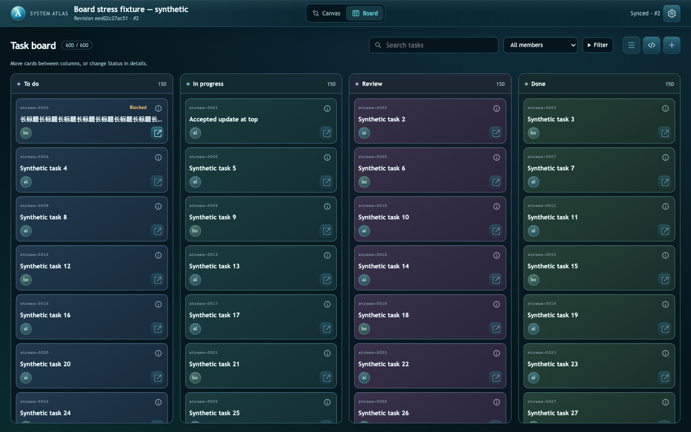
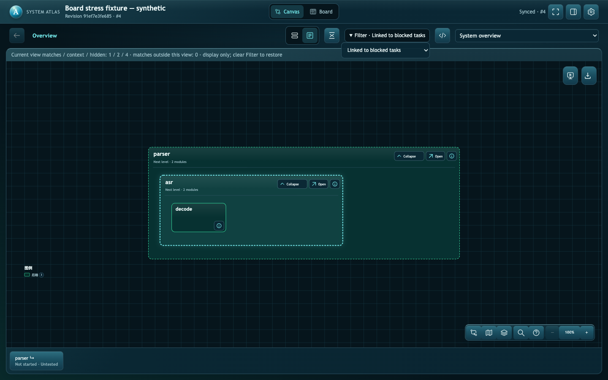

# 比赛期 Atlas 小修与验证（2026-09-23）

基于 Windows 补丁 PR #11 `68c23d44c1f674976677e9f9305be8870f9c63a3`；该提交比已实测运行版 `8992d30` 仅增加文档，已核对。依赖仍为上游 0.5.0，未新增运行库。PR 叠加在 #11 分支上，未合并、未部署到正式模型或其他队员电脑。

## 日志结论与处理

来源：yuanzhifang30-sudo 在 [PR #7 固定提交](https://github.com/huaweibei123/huaweicup2026/tree/7923ef50913fb14a9040ec77ff63aed1d29d922c/results/rehearsal/r20260923-0011-35c5/yuanzhifang30-sudo) 的 session-log.md、protocol-evidence.json、member-report.md，以及 [队长分析 PR #12](https://github.com/huaweibei123/huaweicup2026/pull/12)。已完整查收相关 Issue #5 的 53 条评论；未给已下线队员增加新任务。

| 问题 / 风险 | 本次处理 | 仍需保持的边界 |
| --- | --- | --- |
| Windows 目录 fsync EPERM，rename 后失败 | 沿用 #11 的局部修复，不再做第二套补丁 | 文件 fsync 保留；Windows 目录项断电持久性不承诺等同 POSIX；成员完整套件 79 PASS / 12 symlink EPERM FAIL 是历史事实 |
| 成功启动过，不代表旧端口现在可用 | 指南要求读取本次 serve 输出，区分本机 HTTP、Git 同步、队员回读 | 127.0.0.1 是各自电脑；不新增永久服务或公共入口 |
| CLI 短命成员实例的 syncFailure=null 容易被当成同步成功 | query / manifest / state 明确返回 `local-accepted-snapshot` 和警告；队长 state 保留原有 live/offline 标识 | 这是缓存来源标识，不伪装成实时连接探测 |
| 最后 review 上传但没收回执，撤权/停服抢先发生 | 文档固定收尾顺序，未知 pending 留证；不重放已结束预演请求 | 本轮 F3、最终 review/成员撤权回读没有补测，不填成 PASS |
| 维护成本可能高于分工收益 | 短指南规定交接点更新、一次请求提交相关字段、局部读取、一次异常报告；任务卡/Issue/PR 各存一种信息 | 不把 assigned/done 当执行或数学验证；实际 token、网络延迟和长历史成本未测 |
| 多卡片 / 长受阻说明溢出 | 修复列内横向溢出；普通卡标题/受阻说明限两行，详情完整；精简模式统一 94px | 不分页、不自动归档，不改任务状态/模型结构 |
| 过滤信息可能误导 Agent | 五个 Board / 六个 Canvas 预设复用纯函数；当前视图、上下文和隐藏数量显式报告；边界记录保留 | 隐藏不是删除，上下游只按存储箭头，不代表运行因果 |
| Session 工时容易被推断错 | 沿用 at/committedAt/回执 context 的事件语义，记录规则写入指南 | 状态停留时间不是实际工时；不新增计时器或 Timeline |

## 真实浏览器验证

执行于本机 macOS，Node 22.22.3，已安装 Chrome（Playwright headless 驱动）。临时 fixture、临时服务和合成任务，无队员密钥或正式赛题数据。执行结果见 [JSON](atlas-stability-evidence/board-density.json)。

- 600 张卡、每列 150 张：四列独立滚动、固定列头、末卡可达；1440×900、1024×844、390×844 查看，窄屏可横向到 Done，筛选控件没有越界。
- 修复前合法的 1000 字符无空格受阻说明使 337px 宽列内容达 5543px；修复后列 `scrollWidth <= clientWidth + 1`，原文保留在详情。
- 普通/精简切换后各列原可见任务仍可见；精简卡全部 94px；受阻提示可见。编辑草稿切换与页面重载后保留，密度偏好也保留。
- 实际拖动到已有大量任务的列，后端读回 doing；详情选择 review 后后端一致。模块、关系未变。普通已接受更新不丢失各列滚动位置，变更筛选从结果顶部开始。
- 五个 Board 预设的网页任务 ID 与 query 一致；六个 Canvas 预设的节点 ID 与 query 一致；受阻子模块筛选保留两个祖先容器作为上下文，Graph data 与 Agent 读数一致，清除可恢复全部节点。
- 2000 条任务均保留，可按关键字定位末尾任务；Agent 示例将 334 个候选压为一页 20 条、4056 字节，并显式返回 hasMore。浏览器单次耗时见 JSON，仅为本机样本，不是多机性能承诺。





复现（在项目根目录，使用外部已有 Playwright 与 Chrome；不为此加入项目运行依赖）：

```sh
npm ci --ignore-scripts --prefix .agents/skills/system-atlas
node tests/rehearsal/board-density.mjs /absolute/path/to/playwright/index.mjs /temporary/output-directory
```

不传第一个参数时从环境解析 `playwright`；找不到会直接报依赖缺失。脚本 `finally` 停临时服务和浏览器、删临时模型，保留指定输出目录的脱敏截图/结果。图示是本机自动浏览器观察，不代称队员真人验收。

## 机制回归与未测范围

- Skill 目录 `npm test`：**92/92 PASS**，包含新增的筛选边界、分页、无变更断言，以及 CLI 缓存/离线标识回归。
- Windows 补丁已有的 atomic-write 测试另行执行，macOS 6/6 PASS；与任务/筛选 9 项合计 15/15 PASS。主 npm test 没自动包含该文件。
- `python3 scripts/rehearsal_preflight.py` 核对上游原清单及两个局部补丁清单；新增 filters.mjs 也必须通过哈希检查，不允许只检查修改过的上游文件。对新增文件故意注入错误哈希，预检正确拒绝；恢复清单后正常通过。
- 人为错误版本/越权原子拒绝等现有隔离测试继续通过；未开启新轮次，没有复测真实 Windows 浏览器、多机新版 Filter、真实竞赛计算效果或大规模同步历史。
- 全套测试曾从项目根目录误调用，两个 CLI 相对入口测试失败；改从 Skill 目录执行后通过。这是调用目录错误，不隐藏成产品故障。

此补丁只证明上述范围。比赛期间先稳定使用；自定义列应以后由可复用流程预设驱动，Human/Agent 同读定义，本次仅记设计约束。

## 2026-09-23 · 筛选工具栏位移回归

用户指出 Clear filters 出现会将 Search / All members / Filter 向左挤。
本机 Codex 内置浏览器复现：1157px 视口，选择 Blocked 后 Search 和 All members 各左移 135.605px。
另一个来源是 Filter 追加预设名称导致宽度改变；结果计数位数变化也可能使工具栏换行。
此前“没有越界”的检查不足以证明布局稳定。

修复：清除按钮保留位置、无筛选时 disabled；Filter 预留固定宽度并保留完整 title；结果计数按总任务数预留数字宽度。
状态变化只改变内容/可用性，不改变相邻控件的空间分配。窄屏仍允许按视口宽度换行。

实际在同一临时 120 条演示任务中，通过 Codex 内置浏览器执行英文和中文各 35 项坐标比较：
1440、1157、1024、760、390px，每种宽度覆盖五个预设、成员+搜索无结果、清除。
Search、成员选择、Filter、清除、右侧操作组及列容器的 x/y/width/height 最大差值均为 0px。
恢复原界面语言和视口后保留演示页；不修改正式任务模型。
Skill `npm test` 92/92 PASS。可重复的五宽度几何断言已加入 `tests/rehearsal/board-density.mjs`；
本轮浏览器证据来自上述内置浏览器执行，未再次执行整份 600/2000 卡脚本。

后续新增条件按钮、徽标、状态文案时，要先列出出现/消失和最长文案等状态，确定哪些操作区域必须固定，
再验证前后坐标；不能用静态截图、功能可点击或“无溢出”代替布局稳定性验收。
