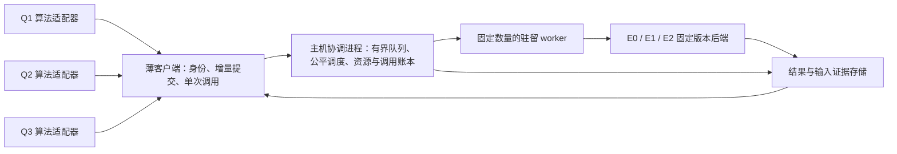

# 三问共享并行评估基础设施：设计提案 v1

2026-09-24；维护 session：`nikolastarx/s-55b66a31d7bd49019122a179563dc1d2`。

本提案将 E2 的目标扩展到**同一资源预算下，更快得到可靠的算法结论和更好的官方方案**。
当前交付是使用方反馈、接口/调度设计和无评估调用的控制面模型检查。共享服务、算法接入、
跨机器执行和真实性能尚未实现或验收。原 E2 PR42/46、独立测试及其固定版本继续保留。
使用方反馈与源码依据见 [NEEDS_AND_EVIDENCE.md](NEEDS_AND_EVIDENCE.md)。
用户进一步要求设计算法探索空间和筛选/演化机制；已汇总三问直接反馈并向同project专项Pro提交r02
咨询，材料与待审初案见 [PRO_R02_RESEARCH_BRIEF.md](PRO_R02_RESEARCH_BRIEF.md)，
实际发送/待回状态见 [PRO_R02_STATUS.md](PRO_R02_STATUS.md)。
发送后P1/P2逐入口复核发现的歧义及勘误见 [PRO_R02_ERRATA.md](PRO_R02_ERRATA.md)；
以下接口已收紧，原上传材料仍固定在ceaed932，不把后续更正冒充已发给Pro。
研究决策层与本文件的作业执行层分开；并发设施本身不证明算法覆盖或筛选质量。

## 1. 三种使用方式，共用同一套身份和资源规则

| 使用方 | 已有实际路径 / 需求 | 首次接入方式 |
| --- | --- | --- |
| Q1 / s-6607，固定基线4dff90e | `search.py`逐候选自适应；profile_refine轮内固定parent；prospective_priority固定池和排名 | 已确认实际接手；同步score_one默认1在途，只有同一冻结轮可显式投机 |
| Q2 本机 s-8ee33 | 刚转入 B；预期每轮 3–12 个候选、代际自适应，当前申请 1 worker | 小批增量提交；已完成结果立即返回；算法等本轮所需结果齐备再选优 |
| Q2 Fang / src/q2 | 固定池非逐候选自适应；M1/M2去重后每单元含复核12–16/20–26次；首意外失败停后续 | 先保持串行停止语义；显式选择并发模式后按原proposal序号同分保留；Trace不必每次传 |
| Q3 s-3172 | 当前结构选一个候选，做一次 P3 E0 后落盘；未来少量候选 | 单次低延迟入口，不凑批；后续研究才使用候选队列/有限 P2-P3 对照 |

并行分三层：跨图/种子/实验分片优先；独立的轮内候选其次；单候选局部编译继续原生化。
一次运行模拟的 1～5 核是赛题参数，与本机使用几个 CPU worker 无关。
加速不能成为无依据增加暴力搜索次数的理由；最终仍比较同等质量时间、同等时间的官方质量。

## 2. 拟议结构与所有权



- E2 专项维护评估内核、后端适配、主机调度/账本和公共契约；算法 owner 维护候选生成、
  轮次汇合、选优/停止规则。调度只改变执行顺序，不暗改候选集合或选优算法。
- 单主机只有一个管理这些实验的协调进程。第一版随一轮研究启动/关闭，不装常驻后台服务。
  客户端断开不代表任务未执行。共享账本在 Git 工作区外，实验结果以不可变导出物交付。
- `score_one` 是同步等待同一调度入口的便利接口；不会绕过全机配额。
  独立 standalone 运行必须有互斥的主机资源分配记录，不能与共享入口各自开满机器。
- 驻留 worker 直接调用后端，不能再启动一套 `E2BatchEvaluator` 子池。
  常用图保留在有界上下文中，worker 回收后重新装载。编译在运行前单独完成/记录，
  不在每个 worker 首次请求中竞争编译同一个动态库。
- Atlas 记录架构、任务和证据状态；它不派发候选、不持有 CPU lease、不承担运行账本。
  共享 Atlas 仍由调度 session 汇总；本提案不直接编辑其权威状态。

## 3. 公平、连续派发与背压

现 E2 `pool.py` 每次取 worker 数量个候选，等整块完成后按输入顺序返回并开始下一块。
有界性有价值，但慢项会同时延迟快项交付和下一次派发。新调度必须做到：

1. 每个 worker 同时最多一个候选；任一完成立即交付，并在有符合资源条件的工作时补发。
2. 按实验队列轮转；每次给一个可运行实验一个 dispatch 机会。租户身份来自已登记实验，
   不能通过多开 session/拆出新 experiment 获得额外权重。项目/使用方的父级配额包含子实验。
3. 每个实验设置 `max_inflight`；默认需求先为1。strict模式始终最多1在途；借用空闲槽位
   仅在显式bounded_speculative、使用方max_inflight、未确认窗口和预算同时允许时发生，
   不能突破任何一项上限。完成交付不代表原序前缀已确认，不自动推进窗口。
   最初用轮转加并发上限；长短任务的 CPU 时间公平是单独指标，不声称轮转天然等价 CPU 公平。
   若实测不均衡，再引入按已用 CPU 债务选择队列，不能凭错误时长预测饿死长任务。
4. 图亲和仅用于公平候选之间的 worker 选择；设最大连续亲和派发数，不能无限等待凑同图。
   新租户等待已运行长任务时受其 deadline 约束；非抢占调度不保证毫秒级开始。
5. 队列同时限制全机/实验候选数、请求字节、结果字节和磁盘配额。满时返回可核对的
   `backpressure`/可等待状态；拒收不消耗一次评价额度。不无界消费候选生成器。
6. 慢客户端不阻塞其他结果：结果先持久化、按 cursor 拉取；输出堆积到额度时停收/停发该实验。
   full 结果写独立限额文件，响应只给带哈希引用；普通 score 不传整条 Trace。

所有客户端共享全机 worker 上限，排队并发不等于执行并发。算法生成器和其 native/BLAS
内层线程同样占预算；不能只管 evaluator、忽略三个算法进程。普通任务约定 1 个执行线程，
需要多线程的后端声明并一次性取得相应配额；生成器等待评分前释放其可释放执行槽，避免死锁。
未纳入管理的浏览器/其他进程保留余量并观测，不能宣称这些也受本服务硬限制。

## 4. 请求、结果与算法语义

以下是 **proposed-v1**，还不是稳定导入 API；当前实际后端仍在 `research/a/e2_search/`。

```python
handle = client.submit(
    operation_id=score_eval_id, candidate_id=cid, experiment_id=exp,
    epoch=round_id, epoch_manifest_hash=epoch_hash, proposal_seq=original_seq,
    parent_plan_hash=parent_hash, parent_result_ref=parent_trace_ref, problem=3,
    graph_ref=graph, config_ref=config, plan_ref=ordered_plan,
    engine_ref=pinned_engine, output="score", oracle_policy="reserve_one",
)
for record in client.completed(handles):  # 完成即返
    results[record.operation_id] = record  # 同candidate的score/full不覆盖
winner = algorithm.select_when_round_ready(results)  # 原proposal序号tie-break，不按完成先后
# 只有独立已声明的官方复核额度允许才提交 official_full。
```

身份分层，不能把一次候选等同于一次评价：

- `candidate_id`绑定problem、graph/config、有序/保留类型的plan、experiment/epoch、父计划hash、
  父结果/trace内容引用、proposal_seq和生成谱系。父状态不可变；from-graph候选显式parent=null，
  不猜当前incumbent。原始plan先保存再派发，调用方后续mutation不得改变请求。
- `evaluation_id/operation_id`绑定candidate身份、官方源码hash、engine源码/构建/ABI、
  output/representation、purpose、费用上界和deadline。重传同operation只查原状态，内容变更
  identity conflict；不同操作的独立复核必须新计预算，不能用旧score响应当新E0。
- 例如同候选C可以有native score操作S和official_full操作F；S重传不重跑，F重传不重跑，
  S与F独立执行/计费，保持同一plan关联。P2/P3分别有problem身份，以pair_id关联而非混用。
  同一生成提议的P2/P3候选可分别命名C_P2/C_P3并共用proposal_id/pair_id；它们是两个评价
  场景，不能覆盖成一条分数。客户端按operation_id收结果，再按purpose/problem投影给算法。
- epoch manifest绑定不可变parent_plan_hash、parent_result_ref、候选有序清单hash、
  proposal_seq→proposal/candidate映射、objective/tie-break、决策与失败模式、是否封闭。
  开放轮次只允许带revision的追加，不能重排、
  更换父状态或回改已派发前缀；每请求固定manifest revision/hash，封闭后才完成轮次选优。
  单步自适应更新父状态须建立下一epoch；算法spec不用全塞进服务，但声明元数据原样冻结/回传。

对外“交付完成”、后端终态持久化、算法确认前缀分别记录。完整评价额度释放只凭相应后端终态/成本
证明，不凭客户端看到了结果；原序前缀停住时，已证实native没有调用E0的预留可单独结算，
但该候选仍占投机窗口。取消和轮次失败不能撤销已经实际发生的费用。

共同结果：identity、state、route/backend、合法性来源、Makespan（cycles）、搬运各字节分项、
cross_task_traffic；P3 另返回完整聚合 cache_stats，hit_rate 保留按字节定义。
不填不存在的字段，不用 0/无穷劣分替代错误，不把未检合法性标为通过。
状态至少区分 official_rejected、unsupported、worker_error、timeout、resource_limit、
budget_exhausted、cancelled_before_start 和执行成本未知；native 不支持的原因与回退结果分开保存。

`score`、将来的 `native_diagnostic`、`official_full` 必须是不同能力。
现 P2/P3 `full=True` 确实调用 E0，绝不是免费 native 诊断开关。
Q3当前单候选允许直接提交一个official_full操作、消耗已圈存final额度后发布；不强制先native
score再多做一次E0。需先筛选的流程才注册score操作和随后独立final操作。
只读能力探测声明支持的 problem/输出/拒绝回退能力，不靠正式样本试探可用性。

Python 原始对象与官方 JSON 分别标 `representation`。官方 JSON 数字 key 变字符串不能用于
证明 Python raw full 严格类型相同。Python 本地适配器保留类型；跨进程/存储若用类型编码，
编码版本及整数/布尔/浮点 key 区别进入协议检查，不对任意嵌套字典统一字符串化。

乱序执行与确定性决策分开：算法声明 epoch 的候选清单/预算和稳定 `proposal_seq`；
Fang 现代码同分保留原顺序先到者，适配后同分取最小原proposal序号，而非candidate_id字典序
或先完成者；其他算法也显式声明自己的tie-break。过期结果
保留证据但不改当前 incumbent。逐候选自适应生成的链不能强行并行。若按 wall 截止选择，
资源调度可能改变截止前完成集合，必须标为 wall-bounded 路径，保存完整完成/取消日志；
它不具备跨资源配置的逐步完全复现保证。固定候选集合的轮次模式可做同集合对照。
P2/P3 通过 pair_id 关联，缺一半标 incomplete；问题身份/模拟 Cache 状态各自独立。
P2 不作为 P3 的无条件硬筛，已有 080 的排名反转依据见 Q3 画像。

### 首意外失败即停：两个不可混称的契约

- `strict_serial_stop`：每实验最多1在途，成功/允许继续的结果确认后才派下一项；复现原串行
  停止需进一步逐入口声明策略，不能仅凭1在途声称复现全部旧算法。不同实验仍能并行。
  现有Fang算法适配默认此模式。P1旧search对返回非ok继续，profile_refine停止后仍可final
  E0提升失败前provisional，prospective_priority则退出且不走final提升；详见勘误。
  adapter manifest必须声明error classification、provisional/confirmed分别何时写入、
  final-on-partial-failure和费用圈存。若改为统一首失败停止/统一回滚，标算法策略改版。
- `bounded_speculative`：使用方在manifest显式选择，并设置 `speculation_window=K`。
  窗口以**按原序号连续确认的前缀**为起点，已完成但前面尚未确认的候选仍占窗口；
  按去重后预声明有序候选列表计数，不用可能跳号的proposal_seq数值差。
  它不是简单的max_inflight。否则一个早期慢候选失败前，后续快候选会不断补发，额外调用
  数可能远超K。窗口把相对该顺序首失败后越过的候选限制在至多K−1个，仍需预算全额预留。
  这里明确计数单位为生成提议proposal；一个提议可有P2/P3等多个必需评价操作，只有manifest
  声明的必需操作全部确认才能推进它的前缀。**K−1提议不等于K−1 E0**：费用上界为所有已派发
  操作的max_full_calls分项之和（E0/E1分开），同时另限制evaluation在途数。final复核有单独阶段和圈存额度。
  这是吞吐与停止一致性的明确取舍；本实验窗口堵塞时调度可服务其他实验。
- 第一条意外失败由可信事件观测到时，立即在协调者事务内锁定声明的失败域并停派发；
  不等待该proposal成为连续前缀，随后按manifest标epoch/stage失败；queued项确认取消后退
  额度，已started项按清理策略终止或有限排空，记录实际/未知成本且不重投。
  若cancel与dispatch竞争，以持久化queued→cancelled或queued→started谁先提交为准。
  若started先提交但执行尚未发生，宁保守记未知也不把消息延迟当免费取消证明。
- 投机模式失败轮保留轮前合法incumbent；该轮所有结果仅留证、不提交新incumbent。
  这与串行流程可能保留失败前中间改进不同，必须明确接受后才用。失败检测时刻仍可能改变
  实际派发集合；不声称跨机器调用次数完全确定。队列原序号和全事件日志必须保存。
- `official_rejected`等预期候选无效是否继续，由manifest错误分类决定；timeout/worker异常
  不能伪装成一个被拒绝候选来绕过“首意外失败停”的约束。最终E0不通过同样明确结束。

### 父阶段停止域与 Fang Stage B 映射

`stage_id`是一次冻结的父运行及其总预算/停止域；`experiment_id`在该父运行内标识一个
case×method单元；`epoch_id`在单元内标识不可变父状态和有序proposal清单的一轮。相同实验
不能通过新epoch重置stage费用/截止或绕开停止；不同case的baseline结果互不替代。
请求同时绑定stage manifest hash、unit序号、experiment/epoch及其revision，父关系注册后不可改。
父stage不是全项目单一串行锁；互相独立、已登记的其他stage仍可并行。

对Fang固定`0b58c123cccf02fc993b741d79dcd8511e4dd38f`的`stage_b.py`/`budget_search.py`，
兼容适配必须保留如下顺序，不能只设置每experiment一个worker：

- 一个stage同时最多一个active unit；按manifest给出的原unit顺序推进。初始plan、探索候选
  和final属于同unit；final是单独收费operation，不能因epoch结束就提前启用下一个unit。
- unit所有结果、final结果或按策略未执行说明、证据落盘和进程清理回执齐备后，父控制器按固定版本的
  `stop_after_unit(receipt, summary)`作决定，协调者持久提交父状态后才释放下一unit派发许可。
  原函数的特定初始plan拒绝组合只封锁同case后续method，其他case可继续；不能把任意
  `official_rejected`都扩大解释成这个例外。正常confirmed单元才继续；监督/清理异常、
  halt_stage、其他未确认/意外失败均停止后续unit。PAUSE在unit边界生效，stage总deadline
  也不能被新unit重置。协议保留这些条件和依据，最终分类由版本锁定的使用方adapter提供。
- 调度器在每次QUEUED→STARTED事务内核验所有祖先的状态/许可，而非只检查epoch。
  stage/case阻断与派发在同一协调者内排序，撤销该范围内未开始的排队操作；未知成本、未清理
  worker仍保留。客户端失联或未提供完整unit回执时父阶段暂停，不自动视为成功放行。
- strict模式在active unit内也只有一个评价在途；即使拆为多个experiment或有空闲槽位，
  都不能越过父许可。未来若并行case×method，manifest必须显式改为新stage策略，并分别
  声明跨unit窗口/失败范围/费用上界及incumbent规则；仅选择epoch投机模式不授权跨unit投机。

这是新增的设计契约，尚未实现父级状态机；已有10项内存模型检查不覆盖多级停止域或多operation。
Fang的[原审阅](https://github.com/huaweibei123/huaweicup2026/issues/33#issuecomment-5805545792)
指出的这一接口缺口在接入前必须由使用方核对，不能声称已获本人接受或旧Stage B已完成迁移。

## 5. 资源和成本是两本相连的账

每个实验 manifest 必填：固定输入/代码、目的、随机种子、候选上限、worker/线程上限、
内存预留、请求/输出/磁盘上限、单候选 execution timeout、排队/全轮 deadline、
显式 E0 和潜在 fallback 次数、全轮 wall/CPU、失败与停止规则。最终复核额度单独圈存，
普通score不能借走。空预算不等于无限预算。
原阶段封存即不可再用；尤其 Q3 当前正式 20 次已经封存、没有本轮可自动使用额度。

资源账：全机 CPU 槽、worker/图驻留/准备峰值/输入/输出/缓存的内存预留、磁盘预留。
只有同时满足约束才派发。以实测 working set + 余量做 admission，不能把 16MiB 对象 LRU
等同进程 RSS。对已启动进程先确认退出/清理，再释放执行资源；未知生存状态保留 lease。
worker 回收是健康机制，不会使一次评价突破瞬时峰值变安全。

调用账：请求预声明`max_full_calls={e0_by_problem, e1_by_problem}`及源码/后端证据；
`max_oracle_calls`若保留，只代表其中E0分项，不能覆盖或省略E1。完整E1不是纯oracle，
但必须独立预留/实耗/unknown并计CPU/wall；E0与E1不能互相兑换。协调者核对固定能力表，
拒绝未知上界或虚报0的请求。显式truth、shortlist、final和外部重试均是另一个收费操作。

LYX固定[09eef20审计](https://github.com/huaweibei123/huaweicup2026/blob/09eef20b2285fadb88b2a6e2cad9b4bd9c389d88/docs/a/e2/audit-lyx-20260924/ROUTE_COST_MATRIX.md)
及本专项[有限只读复核](ROUTE_COST_REVIEW.md)支持以下**条件能力**，输入固定603b074、单次
公开调用、正常JSON形状、预期未替换依赖/库、无外部重试：P1完整E1≤1且严格E0=0；
P2/P3各自完整E0≤1且E1=0。能力注册还须核对实际源码/构建/ABI，不据此宣布当前服务已实现。
冷native准备失败再回退可有两轮prep，但不加算为两个完整评价；prep/CPU成本另计。

第一接入版对可能回退的P1请求预留1次完整E1，对P2/P3请求预留1次本问题E0。
`full=True`也预留相应完整评价；P1 full返回E1，不能冒充official_full纯E0。
可信native成功且证据完整才释放完整评价预留；确认进入的full/fallback转实耗。
route/counter或外层STARTED本身不证明完整函数体已进入；失败记录不足时actual=unknown，
仍保留max对应额度。派发后崩溃/超时/取消不能退款或自动重投。
目前公开接口没有fallback前许可回调及持久函数入口协议；`native_enabled=False`强制后备，
不是拒绝回退。无相应完整评价预算就不能派发可能回退请求；下一后端版本需明确且经验证的
`allow_fallback=False`或拆分native与完整评价能力，才可在该项零预算下执行。私有_native_score
不是可承诺的公共门禁。旧实验驱动的事后route断言/局部ledger不能代替事前预留。

```text
RECEIVED → RESERVED+QUEUED → STARTED → TERMINAL+RESULT_COMMITTED
                      └→ CANCELLED_BEFORE_START（原子取消后退预留）
STARTED → TIMEOUT/CRASH/UNKNOWN（无自动重试；执行资源与调用预留分别结算）
```

资源、额度预留和入队由同一主机协调者的事务完成；拟用本机 SQLite 单写事务和追加事件，
结果先落临时文件并校验/提交后引用。重启恢复必须检查事件/lease/worker 存活，不从“无结果”
推导“未调用”。SQLite 文件不跨 Git 合并、不放网络共享目录。不能保证崩溃间隙的物理执行
恰好一次；提供幂等提交/结果交付及保守 UNKNOWN，明确阻止自动重复执行。

OS 硬限制与监测隔离：Linux/Windows/macOS 后端分别验证 CPU/内存/进程树限制能力；
不把进程 RSS 采样/定期回收标为硬 cap。首版 macOS 若只做到 admission+监测+终止，
能力表必须明确内存不是瞬时硬上限，未提供硬内存能力的主机拒绝要求 hard cap 的运行。
跨机器按 manifest 预先划分调用额度和资源，回执不清的分片不重新发包，不能双花真值预算。

## 6. 有限缓存和版本隔离

可共享的是只读图索引和输入字节；编译对象仅在依赖完全一致时复用。
第一版采用每 worker 有界 LRU + 全机 resident 上限；按图亲和减少重复加载。
之后再验证紧凑数组/只读映射是否能降低多进程复制，不先承诺 Python 图对象零拷贝。

键必须包含场景、配置、完整有序计划、官方/引擎版本、ABI 和相关表示。不能排序 JSON key
后假定顺序无语义，也不能假定改变两个核就只有两个局部编译失效：COPY ID、补边、任务编号
可能有跨核影响。先证明依赖边界，再做局部增量失效；没有证明就全准备。
P3 模拟 FIFO Cache 每个候选从官方初始状态开始，不继承上个候选的 Cache 内容。

v1 不做跨实验最终分数复用和跨请求 single-flight 去重，以保持调用、取消和独立复核清晰；
只处理同一 operation ID 的重传。以后开启结果缓存需另标历史证据来源、缓存读取成本和新鲜
官方复核要求，不能用缓存命中把正式实验伪装成新增独立真值。

## 7. 性能目标与不能相乘的数字

已存 case005、16 新方案全批数据：单 worker P2/P3 E2 为 4.697/4.832 秒；2 worker 为
2.888/2.889 秒。各问题 1→2 worker 的全批提升约 1.63/1.67 倍；相同 worker 对 E0
约 1.51～1.58 倍。单格一次、主机未独占；不是新的复测，也不能推出 18 worker 线性提升。
两问题局部准备约占旧 1 worker 全批 95%（是全部准备，不是已证明某单一函数），
因此提高单候选速度的主要研究仍是准备阶段原生化/结构复用，而非继续压缩毫秒级全局回放。

对固定候选依赖图、C 个 CPU 槽，理想完成时间至少受 `max(总计算工作/C, 最长依赖链)`
限制，另有启动、IPC、资源争用、结果存储和在线 E0。独立图/种子可提升总吞吐，不能把
这个并发收益当同一候选延迟；30×内核和8个worker也不能直接写成整算法240×。
Q3 当前完整在线约100～121ms，其中官方 import/config/evaluate 合并段约57～75ms；
它尚未拆开 profile。现方案优先避免增加排队/IPC固定开销，保留单候选对照。

要验收的指标：

- 主指标：同官方质量的完成 wall；相同 wall/CPU/真值预算下的官方 Makespan、搬运和 P3 hit_rate。
- 吞吐：新增、不同候选/秒、完整实验完成数/小时；同时报告资源总量和 CPU-seconds/有效候选。
- 服务：单候选服务时延与端到端含排队 P50/P95/P99、Q3单请求、各实验等待/份额、超时/取消率。
- 资源：整组父子 RSS、来源/采样方法、实际线程/worker、驻留/缓存/输出/磁盘峰值和回收后残留。
- 正确性：原有误差/排序门槛、同结果字段、合法/非法一致、fallback/复核成本、崩溃/恢复不超账。

先在冻结总资源下比较“各算法独立小池”和“共享连续派发”，比较候选集合/最终质量保持一致。
再在独立登记的 1/2/4 worker 阶梯中测边际吞吐与尾延迟；当前主机硬件18 CPU/48GiB只是容量
信息，不是可全占的实验配额。未验证前不设置自动开满机器或吞吐倍数承诺。

## 8. 实施顺序与验收边界

| 阶段 | 本专项工作 | 使用方/独立测试方工作 | 完成依据 |
| --- | --- | --- | --- |
| 本次设计 | 需求映射、源码瓶颈、状态/公平调度模型 | 已收到P1、两Q2和Q3本人反馈，职责回交已确认 | 固定文档、0评估模型检查；不提升E2验收等级 |
| M1 最小公共入口 | 有界 submit/completed/score_one、事务账本、资源租约、固定后端和零额度守卫 | Q2/Q3各做薄适配；Q1由明确owner接手 | 合成后端故障注入、进程清理、重启和慢客户端；无正式图预算消耗 |
| M2 有界真实接入 | 首先只接1 worker；按已接受实验manifest扩大到混合3客户端 | 算法保存候选集合/轮次、E0赢家确认；独立核对账本 | 同输入/结果、预算/资源不超限；单候选和混合负载真实指标 |
| M3 内核提速 | 分解准备profile，原生化和证明可复用的局部编译；等价回归 | 用真实小批/改序/改分核输入挑反例 | 固定新版本差分+同输出公平性能测量；不改旧被测版本 |
| M4 多机分片 | 固定源码/输入manifest、静态资源/调用额度切片、断点结果合并 | 各机独立验收资源控制/重跑规则 | 同版本/身份、重复或未知不双花、故障分片单独隔离 |

M1 的缺口很具体：现 pool 只有单调用方整块派发；没有全机事务账本/公平入口；
现 P23 自动回退不能在仅靠外部结果检查时禁止 E0。优先做这三个接口边界。
M2 需要各使用方自己的新实验 manifest，不能借本设计重启封存算法实验或未完成的独立验收。
不先引入 Redis/Ray/集群控制平台、远端服务或 GPU；先使一台机器上的三个客户端可靠共存。

本次控制面模型10项检查通过，[结果和范围](../../../results/a/review/evaluation-concurrency-model-20260924/README.md)。
全部使用虚构整数时长/内存权重、0真实worker/0评价。三队列例中公平派发使小请求更早完成，
总完成虚拟时刻却从27变28；这特意保留了尾延迟与总批耗时的取舍，不把它包装为全面提速。
模型只说明这些有限规则例可运行，真实持久性、进程清理、公平压力和性能必须由M1/M2验证。

给调度的 Atlas 建议：原 E2/P23 保持 review；另记录“共享评估基础设施”设计阶段，
关联需求和本交付，implementation=未接入、runtime=未部署。Q2/Q3反馈是需求确认，
不是所有接口已接受；Q1已由s-6607本人确认接手。LYX 与 Fang 原固定测试均保留。
已读公共b432be74的免费GitHub约定；仅本机必要验证，不启用/触发Actions或付费云资源。
