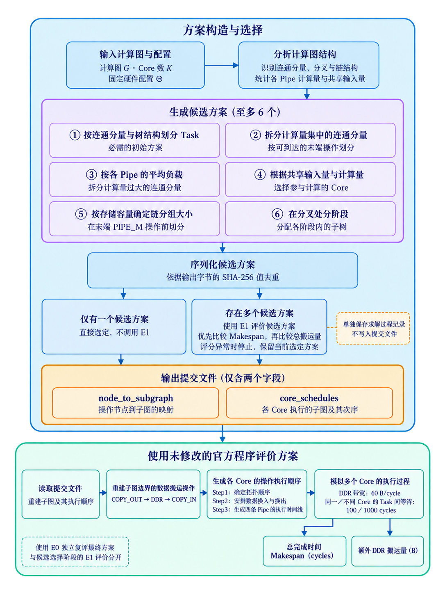

# 图4-1：验收后美化与语言改写

交付状态：**用户已于2026-09-26明确确认当前美化稿，现正式送队长审核，尚未获队长接受或插入论文**。图像字节保持不变；完整指标及最新规范差异见[送审清单](DELIVERY.md)。

## 任务六字段

1. 目标：用户指定对刚通过逐图验收的图4-1调用生图模型美化，按队长实际成图风格及论文验收台语言规范修改，然后交接。
2. 输入：farmer v8，固定 b3b5ed8ec112a0f87baba184937ff7fe9e1dcd6e 的 figures/a/jia-fig4-1-20260926/；[逐图验收回执](https://github.com/huaweibei123/huaweicup2026/issues/14#issuecomment-5843789624)。原图对应 a0537aeb72dc702af86d67d3194587d581ac207c 的旧v4。
3. 输出：PNG候选、逐轮原始提示词、[语言映射与检查](LANGUAGE_REVIEW.md)、外置[图注](caption.md)、来源与输出哈希manifest.json。原可编辑drawio/原始SVG未修改，仍在固定来源目录。本次PNG不冒称真矢量或可编辑源。
4. 限制：仅本图视觉和语言；不改算法、原验收、甲乙写区或正式论文。0 solver/Task/E0/E1/E2/Pro；不触发Actions。生成用内置image_gen工具，共8次调用（过程稿因文字/连线/透明背景问题未采用）。
5. 验收：本会话逐块查看最终生成稿并核对图内文字、主要分支、标识符、数值单位、图号图注分离及实际RGBA通道。原子来源与输出哈希机检。独立语言验收、队长整稿纸面检查、最新算法适配未完成；详细限制见LANGUAGE_REVIEW.md。
6. 节点：2026-09-26提交队长审阅；没有另设硬截止。已有图不覆盖，后续修改另存版本。

## 风格和语言版本

- 实际风格参考：e509c998ea5a3a0a8ceeb0ec59153c0b297ca133 的 paper/manuscript-v1/figures/fig-framework-zh.png 和 fig-hypercut-paper.png。保留浅蓝/青绿/淡紫/琥珀、深蓝宋体风格文字、较细框线与箭头；不宣称生成字形对应认证字体。
- 规范：同提交的 FIGURE_PRODUCTION_PROTOCOL.md / TERMINOLOGY.md；论文验收台 catalogue.json@2d5fbdc66d9fbd5b6ac5988706546e4d60a6ab42，标准2026-09-26.3，L01–L12。
- 最终文字与布局提示词：[prompt-v7.txt](prompt-v7.txt)；其后只以[prompt-v8.txt](prompt-v8.txt)请求移除伪透明背景。prompt-v1～v6为真实过程记录，不是当前逐字稿。未采用图保存在本机任务产物历史中，不作为正式图片重复发布。

## 对整稿的影响

队长P1主算法当前采用834d8c95，本图仍是已验收旧v4的美化。必须按版本一致性选择用途；不能把新均值配到这张旧流程图并宣称新方法。若要更新算法，由算法/原图负责者给正确骨架后另版改图。本会话已把该差异和语言清单送达协调及验收通道，送达不代表对方已读或接受。

生成不是确定性绘图过程。提示词和参考哈希供追溯，不能保证再次调用得到同字节图片。检查脚本只读取图像/计算哈希，没有用代码绘图或改字。
