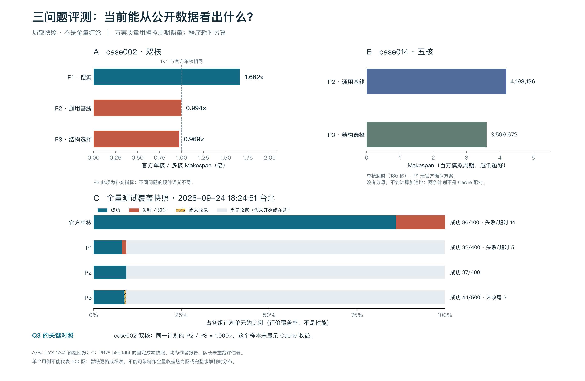

# 三问题评测：公开局部快照



这是用户要求查看性能时，对已有公开数据的可视化。未启动求解器、官方评估器或新实验。图中数字属于成员报告，未将它们提升为队长独立运行验收。

## 数据与范围

- A/B 面板来自 [LYX 预检回报](https://github.com/huaweibei123/huaweicup2026/issues/15#issuecomment-5811697291)，发布时间为 2026-09-24 09:41:24 UTC。仅覆盖 case002 双核和 case014 五核，原文保存在 `results/a/p123-captain-snapshot-20260924/preflight-source.json`。
- C 面板来自 [PR78 固定提交的成本快照](https://github.com/huaweibei123/huaweicup2026/blob/b6d9dbf22f1ffdeb201d953846382d64b9007dfd/results/a/p123-multicore-20260924/costs-20260924T102451Z.json)，时间为 2026-09-24 10:24:51 UTC（台北 18:24:51）。本地保存原始字节为 `costs-source.json`。这是运行中的非原子收据快照，不能代表当前实时进度或最终完成率。
- 以上两项属于不同时间点，已在图中分开标注。预检成绩不用于补齐覆盖率快照的逐格结果。
- 当前 P1 是 4dff90ef 的搜索路线，P2 是 0b58c123 的通用构造基线，P3 是 a4e7ee13 的结构选择路线。各问题硬件语义不同，不能据此认定某个问题的算法普遍优于另一个问题。

## 能得出的结论

- case002 双核：官方单核 Makespan 为 261945；P1/P2/P3 分别为 157602/263397/270245 模拟周期，对应单核/多核比值为 1.662/0.994/0.969 倍。P1 在这个样本有收益，另外两条路线在此样本未超过单核基线。
- P3 的主要对照是同一计划、相同核数的无 Cache / Cache Makespan。case002 的该比值为 1.000 倍，没有显示 Cache 收益。图中单核/P3 只是补充指标。
- case014 的单核基线在 180 秒上限下超时，不能计算单核/多核比值。P2/P3 的 4193196/3599672 周期来自不同计划，不能相除充当 Cache 收益。
- 覆盖率表示收据状态：成功、失败/超时、尚未收尾、无收据分别保留；缺失不等于零或失败。三条求解路线在该固定快照中共有 113 个成功单元，计划总数为 1300，尚不能形成全量性能结论。

## 后续图表

逐格成绩到达后，优先绘制三个问题各自的“用例 × 核数”收益热力图（1 倍为中性，缺失与失败单独编码），并附有效样本数。P3 主图使用同计划 Cache 对照。另用求解墙钟的分布图、P50/P95，以及同问题同用例的质量—耗时散点展示速度和取舍。

目前缺少已发布的逐格成绩及端到端耗时分布，所以没有凭计数、重叠的时间总和或少量预检外推完整热力图。已向 LYX [请求现有快照](https://github.com/huaweibei123/huaweicup2026/issues/15#issuecomment-5812978599)，不要求重跑或打断批次。

## 复现与验证

在项目根目录，使用尚不存在的输出目录：

```sh
uv sync --locked
uv run --locked --no-sync python src/analysis/plot_p123_public_snapshot.py --output output/p123-public-snapshot
```

需要已安装的中文字体之一：PingFang SC、Noto Sans CJK SC、Microsoft YaHei 或 Arial Unicode MS。本次使用 Python 3.12.13、Matplotlib 3.11.2、NumPy 2.5.3、PingFang SC。字体和导出元数据可能导致不同平台的图文件字节不同。

输入、绘图代码及输出 SHA-256 见 `render-receipt.json`，数值表见 `preflight_metrics.csv`；源数据目录为 `results/a/p123-captain-snapshot-20260924/`。PNG 已实际查看，PDF/SVG 同次导出。已核来源哈希、比例与计数、缺失值保留及图片排版；这些是图表检查，不是算法正确性或完整性能验收。绘图代码为本项目原创，设计参考项目 scientific-figures 与 scientific-figure-making 技能。
