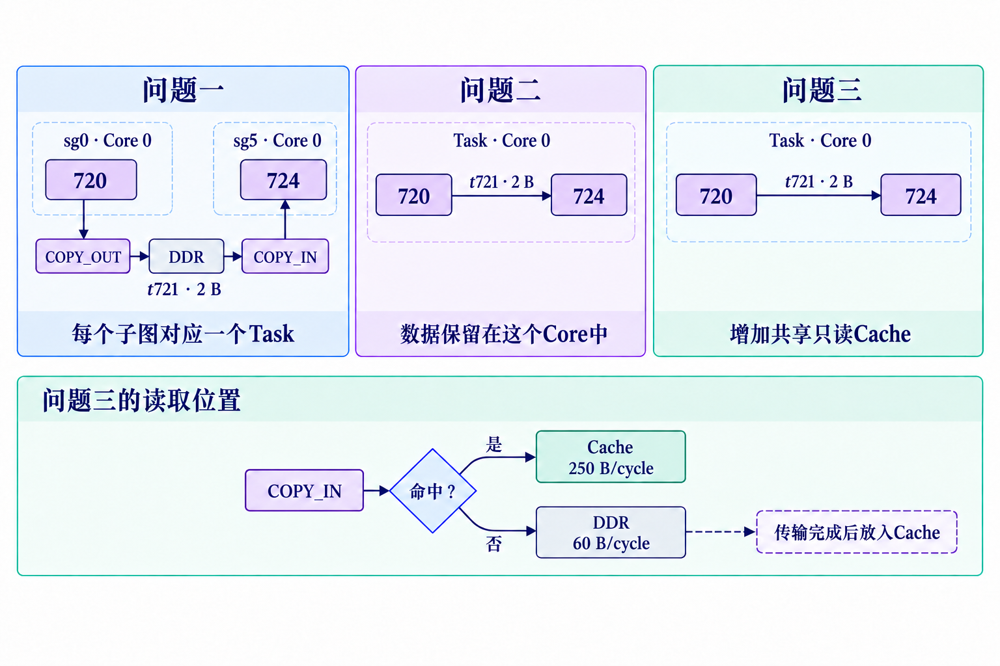

# 成员图件同步与风格对齐

2026-09-26，用户要求 Fang 尽快汇总本人及另外两位成员的图件，与论文会话同步并对齐风格。本文是可执行的短交接，不新增算法实验或评价预算。

## 先同步现有成果，再决定需要改哪些图

请 Fang 在 Issue 26 的本次请求下提供一张清单：图件 ID、用途、作者/实际负责 session、固定提交和文件路径、预览图、可编辑源文件或脚本、数据输入及哈希、适用的固定算法版本、当前审查状态、是否正在修改。正在修改的图先给当前版本和预计交付时间。请同时汇总 LYX 与 farmer 已有图件，避免同一内容重复开工。

论文作者逐图比较数据是否匹配当前版本、科学内容、纸面可读性、美观和维护成本。同一用途优先采用质量最高且数据匹配的一版；不会因为作者不同或工具不同而重画。旧数据图先换为已冻结的新数据再比较，不新增求解器或评价器运行。

## 已采用的样张

以下是最新机制图的视觉参考，仍需与数据、正文和最终纸面共同验收；它们不是独立科学验收通过的证明。

- [三问执行方式的变化](figures/fig-progression-v3.png)
- [论文整体方法](figures/fig-framework-v2.png)
- [同一张量对应的不同操作分配方式](figures/fig-hypercut-v2.png)

## 可以直接使用的视觉约定

| 项目 | 要求 |
|---|---|
| 整体 | 适合中文计算机论文；浅色、克制、留白足够，不做海报式大标题或发光装饰 |
| 背景 | 机制图优先真实 alpha 透明背景；局部分组可浅色填充。已合格白底图可先交，不能把白底声称为透明 |
| 颜色 | 深色文字 #243244；蓝 #416A93、紫 #8877A8、青绿 #2D918A、琥珀 #C9874D；灰线 #A6ADB5，浅灰 #E7EBEF |
| 数据图颜色 | PIPE_M 蓝、PIPE_V 紫、PIPE_MTE2 青绿、PIPE_MTE3 琥珀。其他颜色必须有图例；颜色不替代单位和标签 |
| 几何 | 柔和浅色分组、圆角适度、细线和清晰箭头；文字不压线、不贴边、不越框；相同对象保持形状与颜色 |
| 比较 | 尽量保持节点位置，只改变分组、Core 分配或顺序；时间比较用相同单位与可比较横轴 |
| 语言 | 解释性标签中文；Core、Task、Cache、Pipe、DDR、COPY_IN、COPY_OUT、原题 ID、符号、单位保留英文或原写法；图内Core不改为“核心”，正文及图注一般写“核心” |
| 术语 | 先核完整英文和题面含义，再采用有依据的中文；不用“流水”“触核”“工作帽”等缩写组合。不以括号英文掩盖不自然的句子 |
| 图文分工 | 图内只放局部对象、动作、变量、坐标、单位和图例。图号、图名、分图编号和长解释由 LaTeX/正文完成，不画进 PNG |
| 大小 | 按论文最终插入宽度查看文字与箭头；脚本保留物理尺寸，避免裁紧后整体缩放使字号失控 |

## 按图选择最省时的正确制作方式

- 机制图：先核结构与标签，再用生成模型排版美化；核对正确的 PNG 可直接入稿，不要求再用代码重绘。提示词一次明确中英文、对象、边、箭头方向、数值、不变量及不允许生成的图外文字。
- 数值曲线、统计图、Task/Pipe 时间线：必须读取真实冻结数据，以代码生成 PDF/SVG；生成模型只能提供样式参考，不能重画数值位置或补造执行事件。
- 只有确实需要可编辑矢量或反复精确更新的图，才增加第三步。不要凭印象重新摆框或把嵌入位图的 SVG 称为矢量复刻。
- 真正来自执行模拟的时间线与理论构造示例分开标明。原图 JSON、提交方案、事件轨迹和图中 ID 必须一一对应；局部片段不冒充完整图成绩。

完整规则：[FIGURE_PRODUCTION_PROTOCOL.md](FIGURE_PRODUCTION_PROTOCOL.md)。词语规则：[TERMINOLOGY.md](TERMINOLOGY.md)。数据图统一配置：[scripts/figure_style.py](scripts/figure_style.py)。

## 回复和接手边界

请回报实际已读提交、准备采用的样张、哪些图能直接使用、哪些需要调整，以及当前修改者。消息发送、本人已读、修改完成、论文采用和独立验收分别记录。论文会话不直接修改成员仍在写的脚本；成员也不同时改论文主稿。请先回现有清单，不必等所有图改完再回复。

## 2026-09-26 最新PDF批注：按整类问题整改

本节覆盖上文关于正文保留Core的旧约定。正文基本使用“核心”；首次定义“神经网络处理器（neural processing unit，NPU）”及其内部“计算核心（NPU core，图中简称Core）”。NPU是处理器整体，Core是内部核心，不把两者直接等同。图内因空间与原标识需要继续写Core。

先说明现实计算任务，再引入计算图；先定义整图与子图，再讨论分组。执行主体是核心，执行对象是子图所表示的操作或任务；不能说“图被执行”“子图生成数据”。给出证明之前说明可能出现的冲突或错误，以及证明要保证什么。概括词必须能够回指已明确说明的具体规则，不能用“硬件条件”等统称跳过题目的实际规定。

用户的六处摘要标注是错误类型的例子，不是全部错误清单。逐章检查相同问题，修改范围包含摘要、标题、正文、算法步骤、图注、图内标签和附录；查找词命中数不是验收结论。CP02保存供用户继续标注，后续修改进入CP03。
