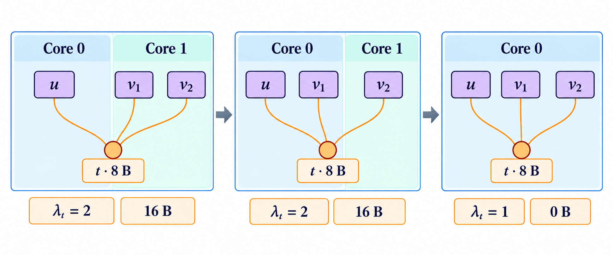

# 问题二：联合安排计算位置与数据搬运

## 同一Core可以保留在不同子图之间传递的数据

问题二把被分配到同一个Core的各个子图合并为一个执行任务（Task）。前面子图生成的数据，可以留在这个Core的L1/UB中，供后面子图中的操作使用。如果生成和读取数据的操作分配到了不同Core，数据仍须通过COPY_OUT写入DDR，再由目标Core的COPY_IN读入；目标读取须等待源COPY_OUT完成后500 cycles。此时，把每个计算操作单独划成子图，也不意味着为每个操作建立独立Task。提交文件中的子图顺序会影响官方程序在这个Core中安排操作的先后次序。

这种变化使分配与排序更加相关。把读取同一张量的操作安排到同一个Core，可能只需搬入一次；但如果两次使用相距较远，这块数据就要保存较长时间，期间可能妨碍其他数据分配空间。把这些操作分到不同Core虽然增加搬运，却可能让计算更早完成。本文分别估计可安排计算的时间和边界复制字节数，再比较完整方案。

## 把计算放进足够长的空闲区间

算法记录每个Core上Cube和Vector已经安排的计算时间区间。安排下一个操作时，先根据保留的计算依赖估计它最早能够开始的时刻，再寻找同类执行单元上足够长的空闲区间。这样，操作可以插到两次已安排计算之间，不必总是排到最后。

设$v$的估计最早开始时刻为$r_v$，计算时长为$d_v$；$\mathcal I_{k,p_v}$是Core $k$的Pipe $p_v$已经占用的时间区间的并集。选取最早的$s_v$使

$$s_v\ge r_v,\qquad [s_v,s_v+d_v)\cap\mathcal I_{k,p_v}=\varnothing.$$

区间采用左闭右开表示，因此一次操作恰好在另一次完成时开始，不算同时占用资源。两条计算支路随后汇合时，算法联合比较它们的Core分配，至多检查$K^2$个Core组合，避免只看一侧较早完成而忽略另一侧。

这个估计没有完整模拟DDR带宽分配、缓存换入换出和存储空间分配次序。因此$s_v$只是生成方案时使用的估计，不能画成官方模拟时间，也不是完成时间的必然上界或下界。算法最终用单操作子图及其列表顺序提交结果，由官方程序决定实际开始时刻。


::: figure-plan {#fig-p2-transition}
引用三问执行条件对照图，说明同一个Core保留数据与在不同Core之间复制数据的区别。正文解释保存期间占用L1/UB；不把估计区间画成实际事件。
:::


## 按同一张量涉及的Core集合计算复制量

先看一个简单例子。计算操作$u$生成8 B的张量$t$，操作$v_1,v_2$都读取$t$。如果两个读取操作分到同一个远端Core，就应按该Core需要的数据副本统计，而不能把两条读取关系视为互不相关的两次向另一个Core传递数据的需求。若只把$v_1$移回$u$所在的Core，$v_2$仍需远端副本，相关边界复制量未必下降；将两个读取操作一起移回后，才消除这份远端需求。

为表示这种多操作共同使用一块数据的关系，引入超边（hyperedge）：它是一个顶点集合，可以同时包含两个以上顶点；由顶点与这些集合组成的结构称为超图（hypergraph）[3][5]。本文以计算操作为顶点，对中间张量$t$建立集合$e_t=\{u,v_1,v_2,\ldots\}$，其中包含生成$t$的计算操作和所有读取$t$的计算操作。超边只表示共同关联，不表示执行方向；原来的有向依赖仍单独保留。

应用以下公式前要求：全部非COPY计算操作已完整纳入模型，原图不同张量标识不通过逻辑标识合并，每个中间张量至多由一个原始计算操作生成，张量字节数为非负整数。这里的“生成”指计算得到数据，不把后来COPY得到的副本当成另一次原始计算生成。

给定Core分配$a$，定义$\lambda_e(a)$为超边$e$中各操作所在的不同Core数量。令$w_e$表示新增一个相关Core所增加的边界复制字节数，$C$表示与分配无关的固定复制量，$\mathcal H$为全部需计入的超边集合。在官方Step2插入容量不足所需的缓存换出、换入之前，复制量为

$$D_{\mathrm{pre2}}(a)=C+\sum_{e\in\mathcal H}w_e\bigl(\lambda_e(a)-1\bigr).$$

式中$D_{\mathrm{pre2}},C,w_e$的单位都是B，$\lambda_e$是无量纲整数。下标pre2只表示官方Step2之前的计算位置，不是另一种硬件性能指标。

对DDR中的外部输入，只把读取该数据的计算操作放入相应集合。每增加一个需要该输入的Core，就增加$b_t$ B的搬入量，所以$w_e=b_t$，第一次输入复制计入$C$。对由计算产生的中间张量，集合还包含生成它的操作；官方边界构造对每个远端Core计入输出、输入一对复制，所以$w_e=2b_t$。最终输出等与分配无关的部分也计入$C$。权重必须按这两类来源分别计算，不能给所有依赖统一赋值。

这说明前述8 B示例中，当$u$在Core 0、两个读取操作在Core 1时，$\lambda_e=2$，该中间张量贡献16 B的边界复制。只移回一个读取操作，仍贡献16 B；两个都移回后，$\lambda_e=1$，该项变为0。这里没有说整个方案的搬运量为0，也没有把16 B换算成未经评价的时间收益。

{#fig:hypercut width=100%}

还可以只更新受移动影响的超边。设一组操作$A$全部从Core $k$移至不同的Core $l$。对与$A$相交的超边$e$，令$n_{e,k},n_{e,l}$为移动前两Core中属于$e$的操作数量。若目标Core原先没有相关操作，则增加一次权重；若源Core的相关操作全部被移走，则减少一次权重。因此

$$\Delta_e=w_e\left(\mathbf1\{n_{e,l}=0\}-\mathbf1\{n_{e,k}=|e\cap A|\}\right).$$

$\mathbf1\{\cdot\}$在括号条件成立时为1，否则为0；没有与$A$相交的超边变化为0。这个式子能够计算字节数变化，却仍未包括缓存容量不足引发的额外搬运，也没有描述计算与搬运能否同时进行。

## 限制计算工作量后重新分配局部操作

算法在上一节的时间区间构造结果上，选择两个Core及最多16条计算链组成局部调整范围。计算链指按依赖前后相接的一串计算操作；范围之外的操作以及必须保持位置的链不允许更换Core。其余操作在所选两个Core之间选择位置。

对于固定范围与固定操作，目标是减少这一范围影响的边界复制量。借助辅助节点，可以把两种Core选择表示为源点与汇点之间的最小割问题（minimum source–target cut）：在一个带非负边权的有向网络中，将指定的源点和汇点分到两侧，并使从源点一侧指向汇点一侧的边的权重和最小。辅助节点把“某条超边是否同时涉及两侧”转换为相应边权，因此求得的是当前局部复制字节目标的精确最小值。

只限制字节数可能把过多计算集中到同一Core。实现因而还规定每个Core、每类计算Pipe的累计计算时长上限。若新的分配超过上限，就固定部分移动链回到原Core，再求解缩小后的局部问题。原分配始终保留为可行选择；若局部有$r$条可调整链，$r\le16$，至多求解$r+1$次。接受前重新计算工作量与复制量，两项检查都通过才保留改动。

**命题5.1。** 若每次固定操作都与原分配一致，每次最小割得到当前局部问题的精确最优值，且接受前核对计算时长上限，则被接受方案的局部$D_{\mathrm{pre2}}$不大于原分配。

**证明。** 原分配在每次增加固定操作后仍可行，因此每次局部最优值都不大于原分配值。最终只接受满足计算时长上限且重新核算复制量不增加的方案，结论成立。$\square$

命题不保证同时带全部工作量约束的全局最优，因为把更多操作固定在原Core会缩小选择范围；它也不保证Makespan下降。算法保留调整前的完整方案，让最终评价决定是否采用新的分配。

## 完整算法及计算量

**算法2：问题二的切分与调度。**

```text
输入：原图G、Core数量K、官方固定配置。
1. 按图结构建立基础方案P0。
2. 在各Core的计算空闲区间中安排操作，得到方案P1；条件不满足时保留P0。
3. 对P1中选定的两个Core和最多16条链，按边界复制量求局部最小割。
4. 检查各Core各Pipe的计算时长上限；必要时固定部分链回到原位置后重算。
5. 只有Step2之前的复制量严格减少，才根据新分配重新安排顺序，得到P2。
6. 保留未修改的P1，按P0、P1、P2的构造顺序去掉完全相同的方案。
7. 完整评价至多三份方案，先比较Makespan，再按代码规定比较新增COPY；同分保留较早方案。
```

这里$P_0,P_1,P_2$是本次求解中产生的方案编号，不是问题编号。没有减少局部复制量，只能决定不产生$P_2$，不能成为删除$P_1$的理由。

设图有$n$个计算操作、$m$条用于构造的计算依赖，查找空闲区间累计扫描量为$Q$。若共调整$R$个局部范围，第$j$个范围的辅助网络有$n_j$个节点、$m_j$条边，含$w_j\le16$条可调整链，一次最小割耗时为$T_{\mathrm{cut}}(n_j,m_j)$，则该部分总耗时不超过

$$\sum_{j=1}^{R}(w_j+1)T_{\mathrm{cut}}(n_j,m_j).$$

此外还需计入依赖识别、排序、空闲区间扫描$Q$及汇合附近至多$K^2$个分配比较。局部最小割不调用完整评价程序，完整在线评分最多三次。全部步骤的时间均计入求解时间。

## 全部用例的结果

固定版本在全部500种图与Core数量组合上得到合法结果。官方主曲线保留使用一个Core时的加速比为1，同时单独列出算法改善仅使用一个Core的方案后的比值。

| Core数量 | 1 | 2 | 3 | 4 | 5 |
|---|---:|---:|---:|---:|---:|
| 官方口径平均加速比 | 1.0000 | 2.3167 | 3.2356 | 3.9711 | 4.5498 |
| 优化方案的 $\operatorname{mean}(B/M)$ | 1.2061 | 2.3167 | 3.2356 | 3.9711 | 4.5498 |
| 对前版改善/持平/退化 | 59/41/0 | 64/36/0 | 54/46/0 | 49/51/0 | 42/58/0 |

与前一完整版本相比，268种组合的Makespan缩短，232种持平，没有变慢；69张图至少在一个Core数量下得到改善。这些结果说明整个固定组合算法在给定数据集上的表现，不能单独证明每个局部方法对所有输入都不会退化。

全部组合的额外DDR总量从3043860416 B增至4159738560 B，增加约36.66%。其中55种组合的时间与搬运同时减少，199种时间减少而搬运增加，14种时间减少、搬运不变，232种两项均不变。算法选择以完成时间为主，因此会接受这类以更多搬运换取更早完成的方案。

平均求解时间为4.029秒，95%分位数为18.841秒，最大40.187秒。独立E0评价的平均时间为1.410秒，95%分位数为6.592秒，最大13.980秒。这批结果在共享Mac上用一个工作进程取得，整批约46.63分钟；新建进程不代表清空了操作系统缓存。


::: figure-plan {#fig-p2-results}
显示固定完整版本的平均加速比，以及500组时间和搬运变化。前后版本、仅使用一个Core时的基线分母和全部原始值都保持不变。图注区分复制字节与完成时间，采用各自明确的单位。
:::


## 为什么没有额外缓存换入换出仍可能更慢

为检验只按容量和搬运量构造方案是否足够，已有实验对另一种固定构造C04评价了六个预先选择的5 Core用例。C04是该实验的代码标识。六份方案都合法，且官方Step2未插入因容量不足产生的缓存换出、换入，但完成时间全部长于本章主算法。

| case | 主算法 / cycles | C04 / cycles | 相对变慢 |
|---|---:|---:|---:|
| 005 | 33515 | 38209 | 14.01% |
| 016 | 2091375 | 2399125 | 14.72% |
| 019 | 16247 | 28514 | 75.50% |
| 025 | 942938 | 975658 | 3.47% |
| 039 | 449653 | 494942 | 10.07% |
| 075 | 343930 | 452120 | 31.46% |

其中case_019、case_039、case_075的COPY字节减少，完成时间却增加。这个事实足以否定“少搬运且不发生缓存换入换出就必然更快”，但不能只凭两个汇总数字确定具体原因。即使计算操作的顺序不变，搬运操作的顺序、不同Core之间传递数据所需的等待及DDR请求同时发生的情况仍可能改变。


图 \ref{fig:p2-counterexample} 展示这两种方案的官方模拟时间线，说明搬运量较小并不意味着计算能够更早完成。

::: figure-plan {#fig-p2-counterexample}
case_019、5 Core，主算法与C04的官方事件使用相同时间尺度。分别显示Task与Pipe区间；主算法16247 cycles，C04为28514 cycles。图注写明C04没有容量不足引起的缓存换入换出，但更慢。不把白色间隔解释为未经证实的原因。
:::


本章因此只用边界复制公式指导分配，不把它当作完整执行时间模型。问题三增加共享只读Cache后，还要判断读取请求到达时数据是否在Cache中，单看操作分到哪个Core更加不足。
