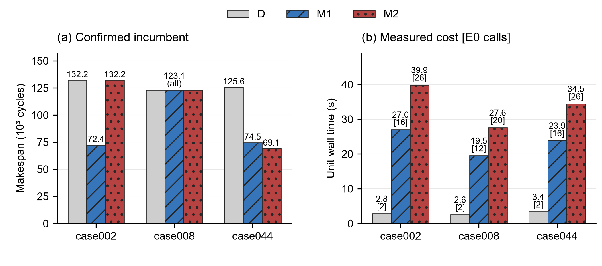
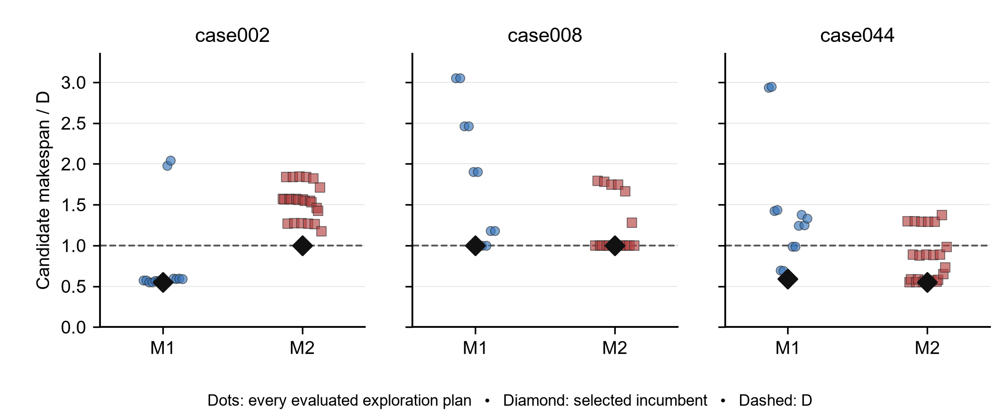

# Q2/B stage B: completed finite comparison

All values below are generated from saved official Q2 outputs. No additional evaluations were used for verification or packaging.

## Task and scope

- Goal: compare D, packet/core proposals M1, and fixed-D-core priority/granularity proposals M2 under identical ceilings.
- Inputs: public case002/008/044, frozen config/E0, four cores, deterministic seed0 tie rules; no sealed test set.
- Outputs: metrics.csv, candidates.csv, nine lossless evidence ZIPs, readable final plans and source method/limitations.
- Constraints: each unit ≤32 calls/600 seconds; total ≤288/5400 seconds; serial, independently regenerated and evaluated D.
- Checks: all source/input/plan/output identities, full final repetitions, initial plan parity, M2 assignment parity, controller states and whole archive member bytes.
- Checkpoint: development T0 2026-09-24 04:29:06 Asia/Taipei; experiment first started 2026-09-23T20:44:57.229279+00:00; no claim of captain final acceptance.

## Quality and cost

| Case | Method | Final cycles | Reduction vs D | Added COPY (B) | Spill (B) | Calls /32 | Unit wall (s) |
|---|---|---:|---:|---:|---:|---:|---:|
| 002 | D | 132209 | 0.00% | 485376 | 0 | 2 | 2.812 |
| 002 | M1 | 72415 | 45.23% | 605184 | 0 | 16 | 27.047 |
| 002 | M2 | 132209 | 0.00% | 485376 | 0 | 26 | 39.891 |
| 008 | D | 123060 | 0.00% | 0 | 0 | 2 | 2.562 |
| 008 | M1 | 123060 | 0.00% | 0 | 0 | 12 | 19.516 |
| 008 | M2 | 123060 | 0.00% | 0 | 0 | 20 | 27.594 |
| 044 | D | 125648 | 0.00% | 5343264 | 2527488 | 2 | 3.359 |
| 044 | M1 | 74530 | 40.68% | 2864416 | 0 | 16 | 23.860 |
| 044 | M2 | 69113 | 44.99% | 2815776 | 0 | 26 | 34.453 |

M1 improves case002; M2 does not. Neither family improves case008. Both improve case044, with M2 better in this small pool. Equal ceilings do not mean equal consumption: D stops after initial/final calls; finite search families stop after duplicates and all declared parameters are exhausted. No unused budget was spent on new, post-result families.

The selected case002 M1 plan increases partition COPY bytes while reducing time; lower movement is not a sufficient timing proxy. M2 preserves the D core map; its case044 improvement demonstrates an ordering/granularity opportunity for that assignment only. These are public development observations, not strong-solver superiority or generalization.

Figure 1. Generated from metrics.csv; zero-based bars, four cores, seed0. Cost labels show wall seconds and [official calls]. No error bars: one deterministic run per unit. Vector PDF/SVG and provenance are in figures/.

## Retained regressions

| Unit | Duplicate proposals | Explored plans worse than D | Worst cycles | Best specification |
|---|---:|---:|---:|---|
| 002-D | 0 | 0 | 132209 | `"D"` |
| 002-M1 | 10 | 2 | 270245 | `{"kind":"chain","policy":"id","communication":1,"grain":"packet"}` |
| 002-M2 | 6 | 24 | 243729 | `"D"` |
| 008-D | 0 | 0 | 123060 | `"D"` |
| 008-M1 | 14 | 8 | 375521 | `"D"` |
| 008-M2 | 12 | 6 | 220442 | `"D"` |
| 044-D | 0 | 0 | 125648 | `"D"` |
| 044-M1 | 10 | 8 | 370559 | `{"kind":"chain","policy":"critical","communication":1,"grain":"packet"}` |
| 044-M2 | 6 | 6 | 172452 | `{"policy":"critical","grain":1}` |

Official calls: **122/288**, all successful; no official rejection, timeout or resource failure in this measured run. Construction failures: 0. All nine final results exactly repeat their selected result objects. The favorable status count does not prove the families always generate executable plans.

Figure 2. Generated from candidates.csv; each point is an official exploration call, normalized by that unit’s own D. Diamonds include fallback to D. No rejected or missing values are drawn as zero. Style adapted from ChenLiu-1996/figures4papers, CC BY-NC 4.0; see figures/provenance.json and the plotting source.
Unit wall through controller receipts sums to **181.062 s**; including the measured stage-ledger writes, **181.094 s**. Original-stage envelope including the coordination pause: **561.063 s**; between-unit/pause portion **379.969 s**. Each unit remains below 600 s, envelope below 5400 s. Unit timing includes source/graph/config reads, generation, all E0 output, hashing and process cleanup. The last printed measurement records the explicit stage-ledger boundary; printing that timestamp itself is not claimed free.
Largest sampled controller+job-tree working set: **99.680 MiB**. Interval 250 ms, 4 GiB stopping threshold. Sampling can miss spikes/double count shared pages; no OS hard-memory guarantee. Per-call timing, proposal/evaluation totals, worker hash tail, cleanup/receipt and deadline overshoot are in CSV/archives.

## Two control versions and the review pause

case002/008 used `9b544ad28b9515f9ab53070d457774b1d8f65a58` (78 calls). Coordinator review identified continuation after worker failure and missing-summary accounting gaps. After case008-M2 completed, a marked empty case044 directory stopped the original controller before reservation. The resulting FileExistsError is preserved as a coordination interruption, not a candidate rejection.
After 4 controller and 10 process/ledger zero-E0 tests, coordinator explicitly approved `e503e61daed67c97cb09629a6f315b14cae2cca1` for case044 only (44 calls). Faults now stop subsequent units even if summary says confirmed, and charges come from persistent calls.json. Candidate generator and D algorithms did not change; failure classification/control did. Previous units were neither rewritten nor rerun. Stage start/deadline were inherited through the pause; both code identities are retained.
No real official-graph failure exercised the corrected stop path; dummy processes/mock controller checks cover that path. These checks are not cross-machine or cross-platform evaluation.

## Later forced-stop check and delivery-only fix

A later developer rerun at `2422225` passed 4/4 controller checks but only 9/10 process checks: the injected memory-stop test hit Windows WinError32 when immediately deleting inherited stderr. Earlier passing runs and this later failure are both retained. The traceback alone does not prove the exact cause of the file lock.
Delivery-only commit `e2b4c5ad76f2b8f3021f2442c03111ba3d3b2db2` retains process synchronization handles, waits under a single shared cleanup deadline, closes owned handles and reports wait failures as monitor_error. Final developer validation passed 4 controller and 12 process/ledger tests, including 12 bounded forced-stop/immediate-log-cleanup iterations and an injected wait failure. The two suite invocation times were 3.656 s and 11.687 s; see control-validation/handle-wait-fixed-e2b4c5a/run.json. An intermediate 11-test pass with a ResourceWarning is also retained.
These tests use dummy processes or mock workers and consume zero E0 calls. No official graph was evaluated with this third control version. Bounded success does not prove that all future Windows file-lock conditions are eliminated.

## Evidence and reproduction

The nine ZIPs contain **1506 files**, **181277080 original bytes**, compressed to **12186846 bytes**. Each ZIP was reopened and every member size/SHA-256 compared to its original file. evidence_manifest.json contains both archive and member identities; original expanded folders remain on the development machine but are ignored in Git to avoid duplicating large traces. Archive storage is lossless, not sampled evidence.
plans/<case>-<method>.json is the exact selected plan copied for convenient reuse. Official graph files come from the unchanged source-manifest/restoration workflow; source commits are available in Git. Unit archives contain complete result/trace/log, raw stdout/stderr, all plans/specifications, call ledger, identities and monitor samples.
Private path prefixes in shared root/controller and developer-test tracebacks are explicitly redacted. Exact raw logs are retained outside all Git worktrees; redaction_manifest.json binds raw and shared hashes and explains substitutions. Shared redacted logs are not byte-identical originals. The nine unit ZIPs are unaffected. official-source-check.json is explicitly post-run verification, not a backdated per-call preflight.
Post-run verification/compression/report/PR work is separate delivery labor, not solver throughput. Its duration is recorded in packaging.json and did not produce any new E0 label.
Run `python -X utf8 -B -m src.q2.report_b` against the existing expanded evidence to regenerate this report and packages without E0. The search stage has a single nonresettable approval ledger; reproducing nine units requires a new explicitly assigned budget, not a new directory or deleting the ledger.

## Limits and next decision

Only three selected public graphs, four cores and deterministic seed0; no many-seed uncertainty estimate, 100-case/2–5-core matrix, average single-core speedup curve, proof of optimality, strong candidate-pool benchmark or independent final acceptance. The 32-ready lookahead, coarse M1 virtual load model and no-spill frontier preference can miss good schedules; case008 is a clear no-improvement outcome. Research-reported better values use other plans/implementations and remain author reports, not paired baselines here.
Recommend reviewing the preserved regressions and stronger reentrant-stage ordering proposals before authorizing another experiment. Do not extend this finite pool retrospectively or call the entire Q2 task done. Atlas and further budget decisions remain with coordination.
